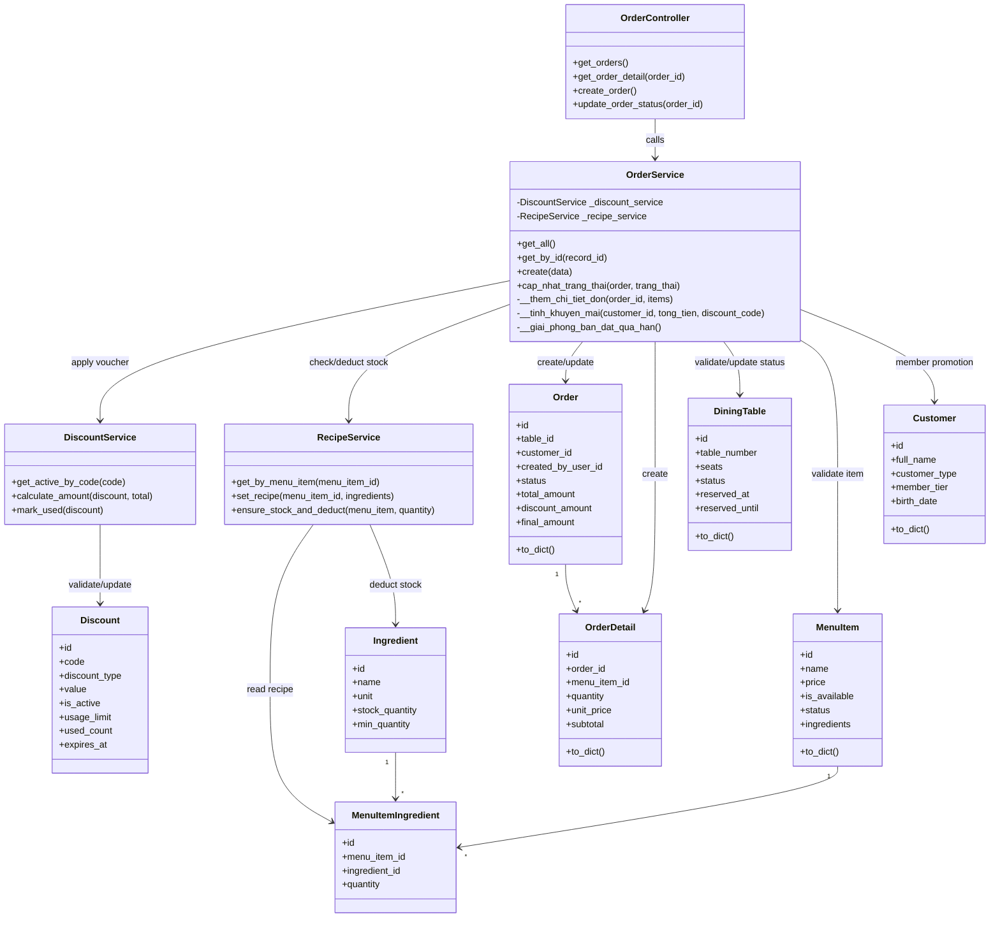
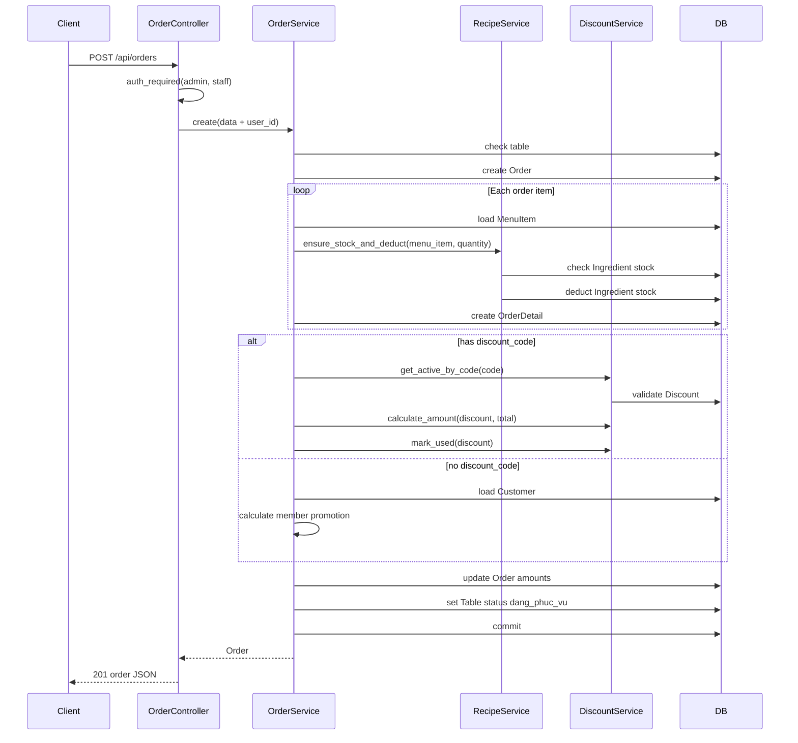

# Chuc Nang Quan Trong Nhat: Tao Don Goi Mon

Tai lieu nay mo ta chuc nang quan trong nhat cua he thong: **tao don goi mon** trong Order module. Day la chuc nang trung tam vi no ket noi nhieu nghiep vu: ban an, khach hang, mon an, voucher, ton kho, thanh toan va hoa don.

## 1. Ly do chon chuc nang nay

Chuc nang tao don goi mon quan trong nhat vi:

- La diem bat dau cua doanh thu nha hang.
- Tao du lieu dau vao cho thanh toan, hoa don, thong ke doanh thu va mon ban chay.
- Co nhieu business rule: ban co dang phuc vu khong, mon con ban khong, so luong hop le khong, co du ton kho khong, co voucher/thanh vien khong.
- Co goi module/service khac:
  - `DiscountService`: kiem tra va tinh ma giam gia.
  - `RecipeService`: kiem tra va tru ton kho nguyen lieu.
  - `Table/DiningTable`: cap nhat trang thai ban.
  - `Customer`: xac dinh uu dai thanh vien/sinh nhat.

Endpoint chinh:

```http
POST /api/orders
```

Controller:

```text
app/controllers/order_controller.py
```

Service chinh:

```text
app/services/order_service.py
```

## 2. Module Order

Module Order phu trach cac nghiep vu:

- Xem danh sach don.
- Xem chi tiet don.
- Tao don goi mon.
- Cap nhat trang thai don.
- Huy don thong qua status `da_huy`.

Cac model lien quan:

| Model | Vai tro |
|---|---|
| `Order` | Don hang chinh |
| `OrderDetail` | Chi tiet tung mon trong don |
| `DiningTable` | Ban an gan voi don |
| `MenuItem` | Mon an duoc goi |
| `Customer` | Khach hang cua don, dung cho uu dai thanh vien |
| `Discount` | Ma giam gia neu order co `discount_code` |
| `Ingredient` | Nguyen lieu bi tru ton kho thong qua recipe |
| `MenuItemIngredient` | Dinh luong nguyen lieu cua mon |

## 3. Luong tao don goi mon

Request mau:

```json
{
  "table_id": 1,
  "customer_id": 1,
  "discount_code": "SALE10",
  "items": [
    {
      "menu_item_id": 1,
      "quantity": 2
    }
  ]
}
```

Luong xu ly:

1. Client goi `POST /api/orders`.
2. `auth_required('admin', 'staff')` kiem tra token va quyen.
3. `order_controller.create_order()` lay JSON body.
4. Controller gan them `user_id = g.current_user.id`.
5. `OrderService.create(data)` bat dau xu ly nghiep vu.
6. Service kiem tra `items` khong duoc rong.
7. Service giai phong cac ban dat qua han.
8. Service kiem tra `DiningTable`:
   - Ban phai ton tai.
   - Ban khong duoc dang `dang_phuc_vu`.
9. Service tao `Order` voi status `dang_xu_ly`.
10. Voi tung item trong order:
    - Kiem tra `quantity > 0`.
    - Kiem tra `MenuItem` ton tai.
    - Kiem tra mon dang ban: `is_available = true`, `status = con_mon`.
    - Goi `RecipeService.ensure_stock_and_deduct(menu_item, quantity)`.
    - Tao `OrderDetail`.
    - Cong don `total_amount`.
11. Service tinh khuyen mai:
    - Neu co `discount_code`, goi `DiscountService`.
    - Neu khong co voucher, kiem tra uu dai thanh vien/sinh nhat tu `Customer`.
12. Service cap nhat tien:
    - `total_amount`
    - `discount_id`
    - `discount_percent`
    - `discount_amount`
    - `final_amount`
    - `promotion_note`
    - `gift_item`
13. Service chuyen ban sang `dang_phuc_vu`.
14. Commit database.
15. Controller tra response `201`.

## 4. Business rule quan trong

### 4.1 Dieu kien tao don

- Don phai co it nhat mot mon.
- Ban phai ton tai.
- Ban dang `dang_phuc_vu` khong duoc tao don moi.
- So luong mon phai lon hon 0.
- Mon phai ton tai va dang ban duoc.

### 4.2 Ton kho va cong thuc mon

Order module khong tu xu ly chi tiet ton kho truc tiep. No goi sang `RecipeService`.

`RecipeService` lam hai viec:

- Kiem tra tung nguyen lieu co du so luong khong.
- Neu du, tru ton kho theo cong thuc:

```text
so_luong_can_tru = dinh_luong_recipe * so_luong_mon_goi
```

Vi du:

- Salmon Nigiri can 10 gram salmon cho 1 phan.
- Khach goi 2 phan.
- Ton kho salmon bi tru `10 * 2 = 20` gram.

Neu mot nguyen lieu khong du, service raise loi va order khong tao thanh cong.

### 4.3 Khuyen mai

Order module goi `DiscountService` neu request co `discount_code`.

Rule voucher:

- Code phai ton tai.
- Voucher phai active.
- Voucher chua het han.
- Voucher chua het luot su dung.
- `discount_type = percent`: giam theo phan tram.
- `discount_type = amount`: giam so tien co dinh.
- So tien giam khong vuot qua tong tien don.
- Dung voucher thanh cong se tang `used_count`.

Neu khong co voucher, Order module kiem tra `Customer`:

- Khach khong phai thanh vien: khong giam.
- Thanh vien sinh nhat trong thang hien tai: giam 10%.
- Thanh vien khong sinh nhat: giam theo hang thanh vien va co the co qua tang.

Luu y: voucher duoc uu tien hon uu dai thanh vien. Neu co `discount_code`, uu dai thanh vien khong ap dung dong thoi.

### 4.4 Trang thai ban

Khi tao order thanh cong:

- Ban chuyen sang `dang_phuc_vu`.
- Neu ban truoc do co thong tin giu ban tam, service xoa `reserved_at`, `reserved_until`.

Khi order duoc thanh toan hoac huy:

- Ban chuyen ve `trong`.
- Neu huy order chua thanh toan, he thong hoan ton kho theo recipe hien tai va giam lai `used_count` cua voucher neu co.

## 5. Module duoc Order goi sang

### 5.1 Discount module

File chinh:

```text
app/services/discount_service.py
```

Vai tro:

- Quan ly ma giam gia.
- Validate voucher co dung duoc khong.
- Tinh so tien giam.
- Tang so lan da su dung voucher.

Cac ham Order module dang dung:

| Ham | Muc dich |
|---|---|
| `get_active_by_code(code)` | Lay voucher theo code va validate dung duoc |
| `calculate_amount(discount, total)` | Tinh so tien giam |
| `mark_used(discount)` | Tang `used_count` |

### 5.2 Inventory/Recipe module

File chinh:

```text
app/services/inventory_service.py
```

Vai tro:

- Quan ly nguyen lieu.
- Quan ly cong thuc mon.
- Kiem tra va tru ton kho khi tao order.

Ham Order module dang dung:

| Ham | Muc dich |
|---|---|
| `ensure_stock_and_deduct(menu_item, quantity)` | Kiem tra du nguyen lieu va tru ton kho |

## 6. So do lop module Order



## 7. So do luong xu ly



## 8. Gia tri dau ra cua chuc nang

Khi tao order thanh cong, he thong dam bao:

- Co record `Order`.
- Co cac record `OrderDetail`.
- Tong tien don duoc tinh tu gia mon tai thoi diem tao order.
- Voucher/thanh vien duoc tinh vao `discount_amount`, `final_amount`.
- Ton kho nguyen lieu da bi tru.
- Ban chuyen sang `dang_phuc_vu`.
- Order co `created_by_user_id` de thong ke doanh thu theo nhan vien.

## 9. Rủi ro va diem can test ky

- Tao order khi ban dang phuc vu.
- Tao order voi menu item het hang hoac bi an khoi menu.
- Tao order voi ingredient khong du stock.
- Voucher het han, het luot, bi tat.
- Khach thanh vien sinh nhat va khach thanh vien theo tier.
- Tao order co nhieu mon, moi mon co nhieu ingredient.
- Thanh toan xong order phai giai phong ban.
- Huy order can kiem tra hoan stock/voucher dung, dac biet khi recipe da bi thay doi sau luc order duoc tao.
