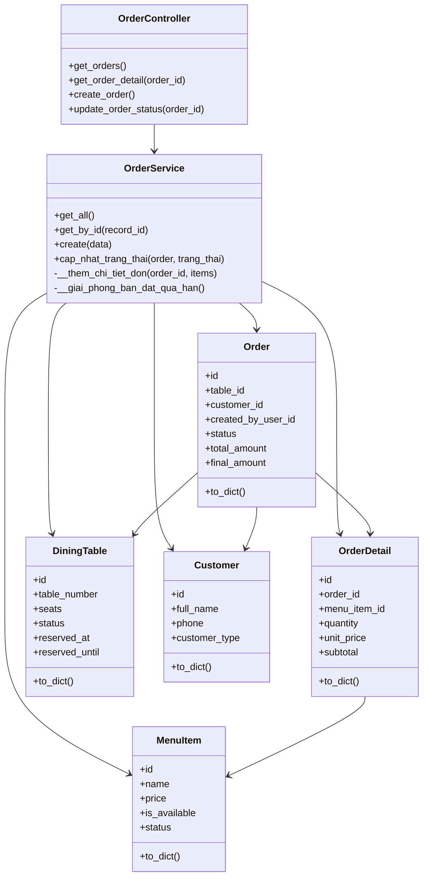
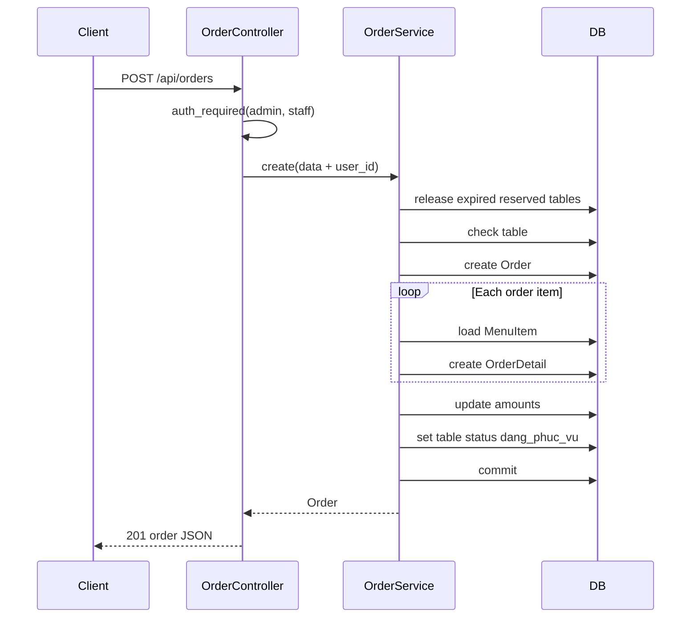

# Chuc Nang Quan Trong Nhat: Tao Don Goi Mon

Tai lieu nay mo ta chuc nang trung tam cua he thong: **tao don goi mon** trong
Order module. Chuc nang nay ket noi ban an, khach hang, mon an, thanh toan,
hoa don va thong ke doanh thu.

## 1. Ly do chon chuc nang nay

- La diem bat dau cua doanh thu nha hang.
- Tao du lieu dau vao cho thanh toan, hoa don va thong ke.
- Co nhieu business rule: ban co dang phuc vu khong, mon con ban khong, so luong hop le khong.
- Co lien ket voi cac model/module: `DiningTable`, `Customer`, `MenuItem`, `Payment`, `Invoice`, `Statistics`.

Endpoint chinh:

```http
POST /api/orders
```

Controller:

```text
app/controllers/order_controller.py
```

Service:

```text
app/services/order_service.py
```

## 2. Module Order

Module Order phu trach:

- Xem danh sach don.
- Xem chi tiet don.
- Tao don goi mon.
- Cap nhat trang thai don.
- Huy don bang status `da_huy`.

Cac model lien quan:

| Model | Vai tro |
|---|---|
| `Order` | Don hang chinh |
| `OrderDetail` | Chi tiet tung mon trong don |
| `DiningTable` | Ban an gan voi don |
| `MenuItem` | Mon an duoc goi |
| `Customer` | Khach hang cua don |
| `User` | Nhan vien tao don |

## 3. Luong tao don goi mon

Request mau:

```json
{
  "table_id": 1,
  "customer_id": 1,
  "items": [
    {
      "menu_item_id": 1,
      "quantity": 2
    }
  ]
}
```

Luong xu ly:

1. Client goi `POST /api/orders`.
2. `auth_required('admin', 'staff')` kiem tra Bearer token va role.
3. Controller lay JSON body va gan `user_id = g.current_user.id`.
4. `OrderService.create(data)` kiem tra `items` khong rong.
5. Service giai phong ban `da_dat` da qua han.
6. Service kiem tra ban ton tai va khong o trang thai `dang_phuc_vu`.
7. Tao record `Order` voi status `dang_xu_ly`.
8. Voi tung item:
   - Kiem tra `quantity > 0`.
   - Kiem tra `MenuItem` ton tai.
   - Kiem tra mon dang ban: `is_available = true`, `status = con_mon`.
   - Tao `OrderDetail`.
   - Cong don `total_amount`.
9. Gan `total_amount` va `final_amount`.
10. Chuyen ban sang `dang_phuc_vu`.
11. Commit database.
12. Controller tra response `201`.

## 4. Business rule quan trong

- Don phai co it nhat mot mon.
- Ban phai ton tai.
- Ban dang `dang_phuc_vu` khong duoc tao don moi.
- So luong mon phai lon hon 0.
- Mon phai ton tai, `is_available = true` va `status = con_mon`.
- Khi tao order thanh cong, ban chuyen sang `dang_phuc_vu`.
- Khi order duoc thanh toan hoac huy, ban chuyen ve `trong`.

## 5. So do lop



## 6. So do luong xu ly



## 7. Gia tri dau ra

Khi tao order thanh cong, he thong dam bao:

- Co record `Order`.
- Co cac record `OrderDetail`.
- Tong tien duoc tinh tu gia mon tai thoi diem tao order.
- `final_amount` bang `total_amount`.
- Ban chuyen sang `dang_phuc_vu`.
- Order co `created_by_user_id` de thong ke doanh thu theo nhan vien.

## 8. Diem can test ky

- Tao order khi ban dang phuc vu.
- Tao order voi menu item het hang hoac bi an khoi menu.
- Tao order voi so luong <= 0.
- Tao order khong co item.
- Thanh toan xong order phai giai phong ban.
- Huy order chua thanh toan phai giai phong ban.
- Don da thanh toan khong duoc huy.
